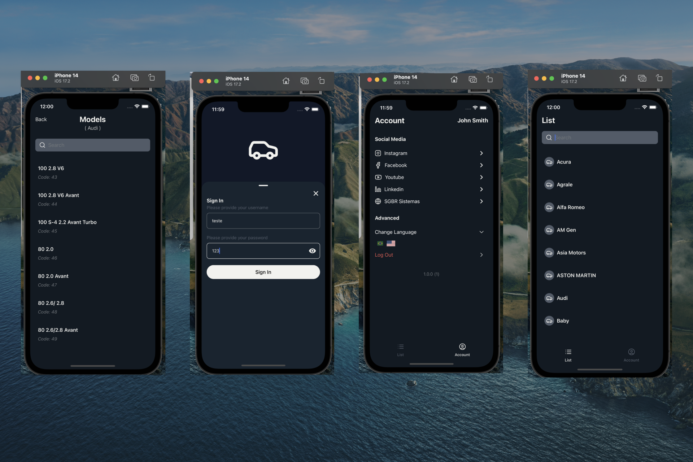

<h1 align="center">Mobile Cars List (React Native - Expo)</h1>

<p align="center">
  

  

  
  
  <a href="https://github.com/williamjayjay/Github-Blog/commits/master">
    
  </a>
    
   <a href="https://github.com/williamjayjay/app-cars-rn-expo/stargazers">
    
  </a>
</p>

<p align="center">
This application is a mobile developer challenge focused on creating a simple yet functional app that adheres to the coding and organizational standards used in the company. The goal is to build an application that lists car brands and allows users to view models of each brand, with a user-friendly and seamless interface.
</p>

<p align="center">

</p>

## VideoCase

https://github.com/user-attachments/assets/dfdb6b39-8f32-4eb8-92f3-83518908dd29


## 🥶 About the Project

I developed this project as part of a mobile developer challenge to improve my skills in React Native, navigation, and state management. The main goal was to create a functional and user-friendly app for listing car brands and their respective models, following best practices and industry standards.

## Mobile React Native:

**Application:** The app allows users to log in, view a list of car brands, and navigate to see detailed models for each brand. It features a responsive design, dynamic data fetching, and a smooth user experience by leveraging modern tools like Context API, React Navigation, and styled components.  

## 🚀 Technologies  

Key technologies used in this application:  

- [Expo](https://expo.dev/)  
- [Typescript](https://www.typescriptlang.org)
- [React Native](https://reactnative.dev/)  
- [React](https://react.dev/)  
- [@react-navigation/bottom-tabs](https://reactnavigation.org/docs/bottom-tab-navigator)  
- [@react-navigation/native](https://reactnavigation.org/)  
- [@react-navigation/native-stack](https://reactnavigation.org/docs/stack-navigator/)  
- [Expo Splash Screen](https://docs.expo.dev/versions/latest/sdk/splash-screen/)  
- [Expo Localization](https://docs.expo.dev/versions/latest/sdk/localization/)  
- [React I18next](https://react.i18next.com/)  
- [i18next](https://www.i18next.com/)  
- [React Native Safe Area Context](https://github.com/th3rdwave/react-native-safe-area-context)  
- [React Native Screens](https://github.com/software-mansion/react-native-screens)  
- [React Native Gesture Handler](https://docs.swmansion.com/react-native-gesture-handler/)  
- [React Native Reanimated](https://docs.swmansion.com/react-native-reanimated/)  
- [@gorhom/bottom-sheet](https://gorhom.github.io/react-native-bottom-sheet/)  
- [@react-native-async-storage/async-storage](https://github.com/react-native-async-storage/async-storage)  
- [@hookform/resolvers](https://react-hook-form.com/get-started/#SchemaValidation)  
- [Zod](https://zod.dev/)  
- [React Hook Form](https://react-hook-form.com/)  
- [Axios](https://axios-http.com/)  
- [Lucide React Native](https://lucide.dev/docs/lucide-react-native)  
- [React Native Flash Message](https://github.com/lucasferreira/react-native-flash-message)  
- [React Native SVG](https://github.com/software-mansion/react-native-svg)  
- [React Native Web](https://necolas.github.io/react-native-web/)  
- [@tanstack/react-query](https://tanstack.com/query/v5)  
- [ts-jest](https://kulshekhar.github.io/ts-jest/)  
- [Jest](https://jestjs.io/)  
- [Jest Expo](https://github.com/expo/jest-expo)  

## Getting Started

To install and configure a local copy, follow these steps:

### Prerequisites

Ensure the following steps are completed to run the app:

1.**Clone the repository**:
```sh
git clone https://github.com/williamjayjay/app-cars-rn-expo
```

2.**Navigate to the root of the project cars-list app mcode**

3.**Install the dependencies**:
  ```sh
  bun i
  ```

4.**Run the application**:
  ```sh
  bun android
  ```
   or
  ```sh
  bun ios
  ```
